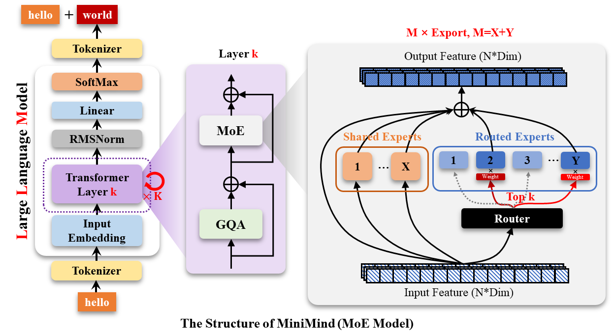

# MiniMind: 小さな知能、大きな可能性

<div align="center">


</div>

<div align="center">

[](https://github.com/jingyaogong/minimind/stargazers)
[](LICENSE)
[](https://github.com/jingyaogong/minimind/commits/master)
[](https://github.com/jingyaogong/minimind/pulls)
[](https://huggingface.co/collections/jingyaogong/minimind-66caf8d999f5c7fa64f399e5)

</div>

<div align="center">
  <h3>「大道至簡」</h3>
  <p>"シンプルさこそ究極の洗練"</p>
</div>

<div align="center">
  

* このオープンソースプロジェクトは、完全にゼロから始めて、最短でわずか3時間の学習でサイズ約26.88Mの小型言語モデル **MiniMind** を作り上げることを目指しています。  
* **MiniMind** は非常に軽量で、最小バージョンのサイズは GPT-3 の約 \(\frac{1}{7000}\) 相当。一般的な個人用GPUでも、推論から学習までスムーズに体験できるように工夫されています。  
* **MiniMind** では、大規模言語モデルの最小構造、データセットのクリーニングと前処理、教師あり事前学習（Pretrain）、教師ありファインチューニング（SFT）、低ランク適応(LoRA)手法、DPO(Direct Preference Optimization)など、全段階のコードを公開しています。さらに、混合エキスパート(MoE)による疎モデルの拡張や、視覚マルチモーダルVLM: [MiniMind-V](https://github.com/jingyaogong/minimind-v) も含まれています。  
* これは単にオープンソースのモデルを実装しただけでなく、大規模言語モデル（LLM）を学ぶための入門的なチュートリアルとしても機能します。  
* 本プロジェクトをきっかけに、研究者の方々が気軽にLLMを試し、さらなる探究と革新を進めてくださることを願っています。

  > 誤解を避けるために補足すると、「最短3時間」というのは、本プロジェクトの作者が使用しているマシンスペック以上のリソースを搭載した環境での推定値です。詳細なスペックは後述します。

---

<div align="center">


[ModelScope でオンライン体験](https://www.modelscope.cn/studios/gongjy/minimind) | [Bilibili ビデオ](https://www.bilibili.com/video/BV12dHPeqE72/?share_source=copy_web&vd_source=670c2504f88726f8cf4a21ef6147c0e8)

---

</div>

## 📌 はじめに

GPT、LLaMA、GLMなどに代表される大規模言語モデル（LLM）は、高い性能を示しています。しかし、たとえばパラメータ数が100億を超えるようなモデルは、個人のGPUではメモリ不足で学習どころか推論すら難しいことがしばしばあります。  
また、単に大規模モデルを部分的にLoRAでファインチューニングして「いくつかの命令を学習させる」だけでは、真の意味でLLMを理解したとは言えません。これは例えるなら、「ニュートンがスマートフォンを使いこなす方法」を教えているようなもので、肝心の学問の面白さから離れてしまいがちです。  
さらに昨今は、有料の講座やサブスクなどで中途半端な知識を元にした解説が氾濫していて、LLMの本質を学びたい人にとっては学習の妨げとなっています。

そこで、本プロジェクトの目標は、LLMを扱うハードルを徹底的に下げ、「0から直接軽量のモデルをトレーニングする」やり方を提示することにあります。

> [!TIP]
> （2024年9月17日時点）MiniMindシリーズは、すでに3種類のモデルを事前学習済みで、最小モデル（26M, 0.02B）ながら、対話をスムーズにできる能力を備えています！

| モデル（サイズ）              | トークン数 | 推論時メモリ | リリース日      | 主観評価（/100） |
|-------------------------|-------------|--------|------------|------------|
| minimind-v1-small (26M) | 6400        | 0.5 GB | 2024.08.28 | 50'        |
| minimind-v1-moe (4×26M) | 6400        | 1.0 GB | 2024.09.17 | 55'        |
| minimind-v1 (108M)      | 6400        | 1.0 GB | 2024.09.01 | 60'        |

> これらの数値はTorch 2.1.2、CUDA 12.2、Flash Attention 2を使用し、RTX 3090（24GB）を2枚搭載したマシンで検証しています。

プロジェクト概要：

- MiniMindのモデル（DenseおよびMoE構造）、事前学習（Pretrain）からSFT、LoRA、DPOによる好み合わせまで、一連のコードとデータセットをすべて公開しています。  
- `transformers`、`accelerate`、`trl`、`peft` などの人気フレームワークに対応。  
- シングルGPU/マルチGPU（DDP、DeepSpeed）トレーニングに対応し、`wandb` で学習過程を可視化可能。途中で一度中断しても後から再開できるよう設計しています。  
- Cevalデータセットを使った簡単なモデル評価コードも用意しています。  
- OpenAI API風のチャットインターフェイスを実装しているため、たとえば FastGPT や Open-WebUI などの既存UIと統合することが容易です。

本プロジェクトが、LLM初心者の方が早期に実践できるための足がかりとなれば幸いです。

### 👉**最近の更新情報**

<details close> 
<summary> <b>2024-10-05 (newest 🎉)</b> </summary>

- MiniMindに多モーダル拡張（視覚）機能を追加しました。

- 詳しくは姉妹プロジェクト [minimind-v](https://github.com/jingyaogong/minimind-v) をご覧ください！

</details>

<details close> 
<summary> <b>2024-09-27</b> </summary>

- 事前学習用データセットの前処理を見直し、テキストの完全性を保つために `.bin` 形式は廃止しました（わずかながら学習速度は低下）。  
- 前処理後のファイル名は `pretrain_data.csv` です。  
- 冗長なコードを削除し整理しました。

</details>

<details close> 
<summary> <b>2024-09-17</b> </summary>

- minimind-v1-moeモデルを更新しました。  
- 過去バージョンとの混乱防止とサイズ管理のため、`mistral_tokenizer` の使用を廃止し、自作の `minimind_tokenizer` に統一しました。

</details>

<details close>
<summary> <b>2024-09-01</b> </summary>

- minimind-v1 (108M)モデルを更新。自作の `minimind_tokenizer` を導入し、事前学習3エポック＋SFT10エポックで学習をより深めて性能向上。  
- ModelScope（魔搭）上にも公開しているので、こちらでもお試しいただけます：

- [🔗ModelScopeオンライン体験🔗](https://www.modelscope.cn/studios/gongjy/minimind)

</details>

<details close> 
<summary> <b>2024-08-27</b> </summary>

- プロジェクトを初めて公開しました。

</details>

## 📌 環境構成

これはあくまで筆者の環境です。各自の環境によって調整してください。  

```bash
CPU: Intel(R) Core(TM) i9-10980XE CPU @ 3.00GHz
メモリ：128 GB
GPU：NVIDIA GeForce RTX 3090（24GB）×2
環境：python 3.9 + Torch 2.1.2 + DDPによる単機マルチGPU学習
```

* Ubuntu == 20.04
* Python == 3.9
* Pytorch == 2.1.2
* CUDA == 12.2
* [requirements.txt](./requirements.txt)

## 📌 クイックテスト (Quick Start Test)

<div align="center" style="font-size: 1.5em; font-weight: bold;">
  
  Hugging Face

[MiniMind (HuggingFace)](https://huggingface.co/collections/jingyaogong/minimind-66caf8d999f5c7fa64f399e5)

 

[MiniMind (ModelScope)](https://www.modelscope.cn/models/gongjy/minimind-v1)

</div>

```bash
# step 1
git clone https://huggingface.co/jingyaogong/minimind-v1
```

```bash
# step 2
python 2-eval.py
```

あるいは、`streamlit` を使った簡易的なWebチャットUIを利用する場合  
> 【注意】Python>=3.10 が必要。`pip install streamlit==1.27.2` でインストールしてください。

```bash
# step 3 (別のやり方), streamlitを実行する
streamlit run fast_inference.py
```

## 📌 クイックトレーニング (Quick Start Train)

###  0. まずはプロジェクトをクローン
    ```bash
    git clone https://github.com/jingyaogong/minimind.git
    cd minimind
    ```

###  1. 環境をセットアップ


  ```bash
  pip install -r requirements.txt -i https://pypi.tuna.tsinghua.edu.cn/simple
  ```

  ```python
  # torchでCUDAが使えるかテスト
  import torch
  print(torch.cuda.is_available())
  ```

  > もし使えないなら [torch_stable](https://download.pytorch.org/whl/torch_stable.html) などから対応するwhlをダウンロードしてインストールし、環境を整えてください。  


### 2. 自力で学習を試したい場合

* 2.1 [データセットのダウンロードリンク](#データセットダウンロード先)から必要なファイルを入手し、`./dataset` ディレクトリに配置します。  

* 2.2 `python data_process.py` を実行し、データを前処理します。
  たとえば事前学習（Pretrain）データのトークン化や、SFT用データセットからQ&A抽出などを行います。  

* 2.3 `./model/LMConfig.py` でモデルのパラメータ設定を調整
  
  > ここでは主にdimとn_layersとuse_moeパラメータを調整します。
  > それぞれ `(512 + 8)` や `(768 + 16)` に設定すると、`minimind-v1-small` と `minimind-v1` に対応します。
  
* 2.4 `python 1-pretrain.py` を実行して、事前学習（Pretrain）を行います。
  完了すると重み `pretrain_*.pth` が出力されます。  

* 2.5 `python 3-full_sft.py` を実行して、教師ありファインチューニング（SFT）を行います。
  完了すると重み `full_sft_*.pth` が出力されます。  

* 2.6 必要に応じて `python 4-lora_sft.py` で低ランク適応（LoRA）手法によるファインチューニングを行います（任意）。  

* 2.7 必要に応じて `python 5-dpo_train.py` でDPO（Direct Preference Optimization, RLHFの一種）を行います（任意）。  


### 3. モデルの推論効果をテスト

- 使用したい学習済みの重み `*.pth` ファイルが `./out/` ディレクトリ配下にあることを確認してください。  

* あるいは[学習済みモデル](#学習済みモデルの重み)をダウンロードして、訓練済みの重みファイル `*.pth` を使用することも可能です。
  ```text
  minimind/out
  ├── multi_chat
  │   ├── full_sft_512.pth
  │   ├── full_sft_512_moe.pth
  │   └── full_sft_768.pth
  ├── single_chat
  │   ├── full_sft_512.pth
  │   ├── full_sft_512_moe.pth
  │   └── full_sft_768.pth
  ├── pretrain_768.pth
  ├── pretrain_512_moe.pth
  ├── pretrain_512.pth
  ```
* `python 0-eval_pretrain.py` で事前学習モデルの連想生成（次トークン予測）を確認します。  
* `python 2-eval.py` でチャット形式の推論を確認します。  
  


🍭「ヒント」：事前学習（1-pretrain.py）と全パラメータ微調整（3-full_sft.py）は、ともにマルチGPUによる加速に対応しています

> 例：GPU1枚しかない場合、普通に下記を実行するだけでOKです。
```bash
python 1-pretrain.py
python 3-full_sft.py
```

> GPUがN枚ある場合（N>1）はマルチGPUを使って高速化できます。

* 1マシンのN枚のマルチGPU環境でトレーニングを開始(DDP: Distributed Data Parallel)
    
    ```bash
    torchrun --nproc_per_node N 1-pretrain.py
    torchrun --nproc_per_node N 3-full_sft.py
    ```
* 1マシンのN枚のマルチGPU環境でトレーニングを開始(DeepSpeed)
    
    ```bash
    deepspeed --master_port 29500 --num_gpus=N 1-pretrain.py
    deepspeed --master_port 29500 --num_gpus=N 3-full_sft.py
    ```
* `wandb` を使って学習を可視化したい場合（必須ではありません）
    
    ```bash
    torchrun --nproc_per_node N 1-pretrain.py --use_wandb
    # シングルGPUなら
    python 1-pretrain.py --use_wandb
  ```
  引数 `--use_wandb` を指定すると WandB (Weights & Biases) に学習ログを記録可能。  
  `wandb_project` や `wandb_run_name` を変更すると、プロジェクト名・実行名を指定できます。

## 📌 データソース

- 🤖 **トークナイザー（Tokenizer）**  
  NLP分野では、自然言語を単語あるいはサブワード単位に分割し、対応するIDに変換するための「辞書」を作る必要があります。これは大規模言語モデル（LLM）において、単語埋め込みや出力層とのマッピングとしてとても重要です。  
  Tokenizerの作り方は主に2通りあり、自分で小さな語彙リストを学習させるか（`train_tokenizer.py` を参照）、すでに公開されているTokenizerを拝借するかのいずれかです。  
  語彙数があまりに大きいとEmbeddingだけでも膨大になり小型モデルを圧迫するため、MiniMindでは自作Tokenizerを用いて6400というコンパクトな語彙数に抑えています。  
  一部の著名モデルでは下記のような語彙数を持ちます：

  <table>
    <tr><th>Tokenizerモデル</th><th>語彙サイズ</th><th>開発元</th></tr>
    <tr><td>yi tokenizer</td><td>64,000</td><td>01-ai（中国）</td></tr>
    <tr><td>qwen2 tokenizer</td><td>151,643</td><td>アリババクラウド（中国）</td></tr>
    <tr><td>glm tokenizer</td><td>151,329</td><td>智谱AI（中国）</td></tr>
    <tr><td>mistral tokenizer</td><td>32,000</td><td>Mistral AI（フランス）</td></tr>
    <tr><td>llama3 tokenizer</td><td>128,000</td><td>Meta（アメリカ）</td></tr>
    <tr><td>minimind tokenizer</td><td>6,400</td><td>カスタム</td></tr>
  </table>

  
  > 2024年9月17日以降、モデルサイズを小さく保ちつつ混乱を避けるため、`minimind_tokenizer` に完全統一しました（`mistral_tokenizer`は廃止）。  
  > minimind_tokenizerの長さは非常に小さく、エンコード・デコード効率はqwen2やglmなどの中国語に適したトークナイザーよりも劣ります。 しかし、minimindモデルは独自に訓練した、語彙サイズが6400しかない`minimind_tokenizer`をトークナイザーとして選択することで、全体的なパラメータの軽量性を保ち、エンコード層と計算層の比率の不均衡により頭でっかちになるのを回避しています。
  >  また、minimindは実際のテストで珍しい単語のデコードに失敗するケースは発生しておらず、良好な効果を示しています。 カスタム語彙表を6400まで圧縮することで、LLMの総パラメータ数を最小で26Mにすることができました。

---

- 📙 **Pretrainデータ**  
  [Seq-Monkey通用テキストデータセット](https://github.com/mobvoi/seq-monkey-data/blob/main/docs/pretrain_open_corpus.md) / [Baidu Netdisk](https://pan.baidu.com/s/114F1k3eksiWCOQLvaT3RYQ?pwd=6666)  
  多数のウェブサイト、百科事典、ブログ、オープンソースコード、書籍など、公開データを一括収集・クレンジングした大規模コーパスです。重複除去や質の精査が行われており、総量は約100億トークン。中文（中国語）主体ですが、LLMの事前学習に用いることが可能です。  

  > 代替として [SkyPile-150B](https://hf-mirror.com/datasets/Skywork/SkyPile-150B/tree/main/data) もあり、そちらは約2.33億の独立したウェブを含み合計1500億トークン、約620GBのテキストデータ。  
  **お試しなら** SkyPile-150Bから一部分だけ取得し、`data_process.py` でトークナイズ＆ .csv化する手もあります。

---

- 📕 **SFTデータ**  
  [匠数大模型SFTデータセット](https://www.modelscope.cn/datasets/deepctrl/deepctrl-sft-data) では、大量の公開データを集約し、安全性やフォーマットをそろえた形で提供しています。  
  中国語で約1000万件、英語で約200万件、計30億トークン規模の命令データが含まれ、LLMの「教師あり微調整（SFT）」に適した内容です。  
  元は以下のようなオープンソースデータを統合しているため、**【SFTデータ】**をダウンロードすれば一式そろいます：

    - [BelleGroup/train_3.5M_CN](https://huggingface.co/datasets/BelleGroup/train_3.5M_CN)
    - [LinkSoul/instruction_merge_set](https://huggingface.co/datasets/LinkSoul/instruction_merge_set)
    - [stingning/ultrachat](https://huggingface.co/datasets/stingning/ultrachat)
    - [BAAI/COIG-PC-core](https://huggingface.co/datasets/BAAI/COIG-PC-core)
    - [shibing624/sharegpt_gpt4](https://huggingface.co/datasets/shibing624/sharegpt_gpt4)
    - [shareAI/ShareGPT-Chinese-English-90k](https://huggingface.co/datasets/shareAI/ShareGPT-Chinese-English-90k)
    - [TigerResearch/sft_zh](https://huggingface.co/datasets/TigerResearch/sft_zh)
    - [BelleGroup/school_math_0.25M](https://huggingface.co/datasets/BelleGroup/school_math_0.25M)
    - [YeungNLP/moss-003-sft-data](https://huggingface.co/datasets/YeungNLP/moss-003-sft-data)

---

- 📘 **DPOデータ**  
  [活字模型](https://github.com/HIT-SCIR/huozi) などから集められた、好みに関する人間のラベルを付与したデータ約8万件です。これを使って、報酬モデルなしでDPO（Direct Preference Optimization）による好み合わせを行うことができます。  

---

- **その他のデータセット**  
  [HqWu-HITCS/Awesome-Chinese-LLM](https://github.com/HqWu-HITCS/Awesome-Chinese-LLM) には、中国語LLMに関するモデル、アプリ、データセット、チュートリアルなどが包括的にまとめられています。随時更新されており、大変参考になります。

---

### データセットダウンロード先

`./dataset/` ディレクトリに置いてください

| MiniMind 训练用データセット  | ダウンロード先                                                                                                                                                                                                |
|-----------------------------|------------------------------------------------------------------------------------------------------------------------------------------------------------------------------------------------------------|
| **【tokenizer学習用】**       | [HuggingFace](https://huggingface.co/datasets/jingyaogong/minimind_dataset/tree/main) / [百度网盘](https://pan.baidu.com/s/1yAw1LVTftuhQGAC1Y9RdYQ?pwd=6666)                                                                                     |
| **【Pretrainデータ】**      | [Seq-Monkey公式](http://share.mobvoi.com:5000/sharing/O91blwPkY) / [百度网盘](https://pan.baidu.com/s/1-Z8Q37lJD4tOKhyBs1D_6Q?pwd=6666) / [HuggingFace](https://huggingface.co/datasets/jingyaogong/minimind_dataset/tree/main)                |
| **【SFTデータ】**           | [匠数大模型SFTデータセット](https://www.modelscope.cn/datasets/deepctrl/deepctrl-sft-data/resolve/master/sft_data_zh.jsonl)                                                                                         |
| **【DPOデータ】**           | [HuggingFace](https://huggingface.co/datasets/jingyaogong/minimind_dataset/tree/main/dpo)                                                                                                                  |

# 📌 モデル構造

MiniMind-Denseは（[Llama3.1](https://ai.meta.com/blog/meta-llama-3-1/)と同様に）Decoder-OnlyなTransformerで、GPT-3との主な違いは以下の通りです：

* GPT-3で採用された「前段の正規化」（Pre-LN）アプローチを導入。具体的にはRMSNormを各サブレイヤーの入口で実行します。  
* 活性化関数にSwiGLUを採用（ReLUではなく）し、性能向上を図っています。  
* GPT-Neoのように絶対位置Embeddingを排し、代わりにRoPE（回転位置エンコーディング）を導入。学習トークン数を超える推論時でもある程度対応しやすくなります。

---

MiniMind-MoEは、Llama3や[Deepseek-V2](https://arxiv.org/pdf/2405.04434)のMixFFNをベースにした混合エキスパート構造（MoE）を採用しています。

* DeepSeek-V2で提案された、前向きフィードフォワード（FFN）の専門分割と共有分割を巧みに組み合わせる手法を一部参考にし、それぞれの“Expert”を効率的に活性化するようにしています。

---

RoPEの計算や推論関数、FFN部分のコードが若干異なるだけで、全体構造は共通です。再描画した図を示すと下記のようになります：




設定ファイルは [./model/LMConfig.py](./model/LMConfig.py) です。現時点で学習済みのMiniMindモデルは以下になります：

| Model Name        | params | len_vocab | n_layers | d_model | kv_heads | q_heads | share+route | TopK |
|-------------------|--------|-----------|----------|---------|----------|---------|-------------|------|
| minimind-v1-small | 26M    | 6400      | 8        | 512     | 8        | 16      | -           | -    |
| minimind-v1-moe   | 4×26M  | 6400      | 8        | 512     | 8        | 16      | 2+4         | 2    |
| minimind-v1       | 108M   | 6400      | 16       | 768     | 8        | 16      | -           | -    |

# 📌 実験結果

| Model Name        | params | len_vocab | batch_size | pretrain_time     | sft_single_time   | sft_multi_time      |
|-------------------|--------|-----------|------------|-------------------|-------------------|---------------------|
| minimind-v1-small | 26M    | 6400      | 64         | ≈2 hour (1 epoch) | ≈2 hour (1 epoch) | ≈0.5 hour (1 epoch) |
| minimind-v1-moe   | 4×26M  | 6400      | 40         | ≈6 hour (1 epoch) | ≈5 hour (1 epoch) | ≈1 hour (1 epoch)   |
| minimind-v1       | 108M   | 6400      | 16         | ≈6 hour (1 epoch) | ≈4 hour (1 epoch) | ≈1 hour (1 epoch)   |

---

1. **事前学習（Text-to-Text）**  
   - まず大量のテキストコーパスを用いて、無監督の次トークン予測（「単語の連想ゲーム」）を学習し、基礎知識をモデル内部に取り込みます。  
   - 例：「秦始皇は」のあとに「中国の初代皇帝」という単語列を高確率で出せるようにする、というイメージです。  
   > 学習率は1e-4～1e-5、エポックは5程度。

    ```bash
    torchrun --nproc_per_node 2 1-pretrain.py
    ```

2. **教師あり微調整（SFT）― 単一ターン会話**  
   - 事前学習段階では「言語知識」が身につきましたが、それをチャットとして活かすためには会話形式を学習する必要があります。  
   - SFTを実行し、「ユーザーの質問と、その回答」というテンプレートを教え込むことで、「ここから先が回答」「ここまでが質問」のような対話の型を身につけさせます。  
   - 実装の都合上、トークン長は512に切り詰めていますが、推論時にはRoPE補正を使うことで、より長いテキストも扱えます。  
   > 学習率1e-5→1e-6にCosine減衰、エポック6程度。

   ```bash
   # 3-full_sft.py 内で sft_data_single.csv を使用
   torchrun --nproc_per_node 2 3-full_sft.py
   ```

3. **多輪（マルチターン）会話のSFT**  
   - 単一ターン（Q→A）を習得したモデルをさらに強化し、過去のQ&Aも考慮に入れた会話パターンを学習させます。  
   - 具体的には history_chat や history_chat_response のデータを使い、Q1→A1、Q2→A2…といった連続的な流れにも対応させます。  
   - 小型モデルは長い文脈保持が苦手であり、学習させ過ぎると逆に単一ターン回答の精度が下がることもあります。  
   > 学習率1e-5→1e-6、エポック5程度。

    ```bash
    # 3-full_sft.py 内で sft_data.csv を使用
    torchrun --nproc_per_node 2 3-full_sft.py
    ```

4. **人間のフィードバックによる強化学習（RLHF）― DPO**  
   - 従来のPPO（Proximal Policy Optimization）などとは異なり、DPO（Direct Preference Optimization）は離線データ中の「良い回答／悪い回答」を比較学習し、人間の好みに合った出力を生成しやすくします。  
   - 報酬モデルを別途学習しなくても、DPOの理論により近似的に好み合わせができます。  
   - RLHFは万能ではなく、場合によっては冗長な表現が増えたり情報精度がわずかに低下したりもします。  
   > 約8万件の三つ組(q, chosen, reject)を使い、学習率1e-5、fp16で1～2エポック程度。  

    ```bash
    python 5-dpo_train.py
    ```

---

### GPT-3との比較

モデル構造については、GPT-3の下記表を参考にするとスケーリングの目安が分かります。


---

### 学習済みモデルの重み

[🔗Baidu Netdisk](https://pan.baidu.com/s/1KUfSzEkSXYbCCBj0Pw-9fA?pwd=6666)

| Model Name         | パラメータ | Config                      | pretrain_model         | single_sft_model                     | multi_sft_model                     | rl_model      |
|--------------------|-----------|-----------------------------|------------------------|--------------------------------------|-------------------------------------|---------------|
| minimind-v1-small  | 26M       | d_model=512<br/>n_layers=8  | `pretrain_512.pth`     | `single_chat/full_sft_512.pth`       | `multi_chat/full_sft_512.pth`       | `rl_512.pth`  |
| minimind-v1-moe    | 4×26M     | d_model=512<br/>n_layers=8  | `pretrain_512_moe.pth` | `single_chat/full_sft_512_moe.pth`   | `multi_chat/full_sft_512_moe.pth`   | -             |
| minimind-v1        | 108M      | d_model=768<br/>n_layers=16 | `pretrain_768.pth`     | `single_chat/full_sft_768.pth`       | `multi_chat/full_sft_768.pth`       | `rl_768.pth`  |

---

# 📌 評価（Eval）

## ① RLHFに関する比較

> 以下は、単一ターンSFTモデル（full_sft）と、DPOによる好み調整をしたモデル（rl）を比較した例です。  
> `rl_<dim>.pth` がDPOで好み合わせを学習したモデルです。

（サンプル略）

### 👉まとめ
- RLHF（DPO）を適用すると、モデルはより丁寧な表現を使う傾向が高まり、回答が少し長くなることもあります。  
- 一方で、情報の簡潔さや正確性がわずかに損なわれるケースも見受けられます。  
- これはPPOや他のRLHFアプローチでもよくあるトレードオフで、必ずしも性能が一貫して上昇するわけではありません。

## ② Instruct Fine-Tuning について

> 2024年9月17日時点でのテスト例です。単一ターンSFTのみ適用し、多輪会話やRLHFは実施していない状態。

[A] minimind-v1-small(0.02B)  
[B] minimind-v1-moe(0.1B)  
[C] minimind-v1(0.1B)  
[D] baby-llama2-chinese(0.2B)  
[E] chatlm-mini-chinese(0.2B)  

サンプルQ&Aを比較すると、Cが最も安定していて、Aはサイズなりに多少の誤りがあり、Bも途中の計算や値に誤りが散見されました。Eは詳細だが冗長、Dは回答が的外れになる例もあった、という印象です。

> これらの回答をGPT-4などに評価させた結果、概ね C > E > B > A > D という順序でした。

---

## ③ C-Evalデータセットでの客観評価

[eval_ceval.py](./eval_ceval.py) でC-Evalを評価しています。  
小型モデルでは多肢選択式に特化した調整を行っていないため、単純に選択肢A/B/C/Dの出力確率を比べ、一番高いものがモデルの回答とみなして正答率を計測しています。  
結果はあくまで参考程度です。

```text
minimind-v1-small
合計問題数: 1346  
正答数: 316  
正答率: 23.48%
```

| モデル              | 正答数 | 全体数 | 正答率  |
|--------------------|--------|-------|--------|
| minimind-v1-small  | 344    | 1346  | 25.56% |
| minimind-v1        | 351    | 1346  | 26.08% |

「得意分野／苦手分野」など詳しい分析は省略しますが、法律、物理、政治、地理など人文社会系の専門分野は低めの正答率でした。  
化学、離散数学など理系科目の一部ではやや高めでした。

# 📌 その他

### 推論＆エクスポート

* [export_model.py](./export_model.py) を使うと、transformers互換のフォーマットにモデルをエクスポートし、HuggingFaceにアップロードできます。  

* MiniMindのHuggingFaceコレクション：  
  [MiniMind](https://huggingface.co/collections/jingyaogong/minimind-66caf8d999f5c7fa64f399e5)

---

### APIによる推論

* [my_openai_api.py](./my_openai_api.py) は、OpenAI互換のチャットAPIを起動するスクリプトです。  
  これにより、FastGPTやOpen-WebUIといった外部UIに組み込みやすくなります。  
* HuggingFaceからモデルをダウンロードし、以下のように配置してください：

    ```
    minimind (root dir)
    ├─minimind
    |  ├── config.json
    |  ├── generation_config.json
    |  ├── LMConfig.py
    |  ├── model.py
    |  ├── pytorch_model.bin
    |  ├── special_tokens_map.json
    |  ├── tokenizer_config.json
    |  ├── tokenizer.json
    ```

* チャットサーバを起動
    ```bash
    python my_openai_api.py
    ```
* サンプルクライアント  
    ```bash
    python chat_openai_api.py
    ```
* OpenAI互換のAPI例：

    ```bash
    curl http://ip:port/v1/chat/completions \
      -H "Content-Type: application/json" \
      -d '{ 
        "model": "model-identifier",
        "messages": [ 
          { "role": "user", "content": "世界で一番高い山はどこですか？" }
        ], 
        "temperature": 0.7, 
        "max_tokens": -1,
        "stream": true
    }'
    ```


### FastGPTでのMiniMind API利用例


# 📌 謝辞

> [!TIP]
> `MiniMind` が役に立った場合は、GitHubのスター（⭐）を付けていただけると嬉しいです。  
> ドキュメントが長いので、もし誤字脱字や技術的なミスがあれば、IssueやPRでご指摘ください。  
> みなさまのサポートが、プロジェクトをより良くしていく原動力です。

> [!NOTE]
> 皆さまの協力が大きな力となります。  
> もし新たなMiniMindモデルを学習された方がいれば、DiscussionsやIssueで共有していただけると助かります。  
> 医療や金融などの特化領域、より大容量の学習や長文対応など、あらゆる拡張を歓迎します。  
> 今後、こちらでご紹介できればと思います。本当にありがとうございます！

## 🤝[貢献者](https://github.com/jingyaogong/minimind/graphs/contributors)

<!--
<a href="https://github.com/jingyaogong/minimind/graphs/contributors">
  
</a>
-->

<a href="https://github.com/jingyaogong"></a>
&nbsp;
<a href="https://github.com/MuWinds"></a>
&nbsp;
<a href="https://github.com/chuanzhubin"></a>
&nbsp;
<a href="https://github.com/iomgaa-ycz"></a>
&nbsp;

## 😊 感謝

<a href="https://github.com/ipfgao"><b>@ipfgao</b></a>:
<a href="https://github.com/jingyaogong/minimind/issues/26">🔗学習手順の記録</a>

<a href="https://github.com/chuanzhubin"><b>@chuanzhubin</b></a>:
<a href="https://github.com/jingyaogong/minimind/pull/34">🔗コード行ごとの注釈</a>

<a href="https://github.com/WangRongsheng"><b>@WangRongsheng</b></a>:
<a href="https://github.com/jingyaogong/minimind/issues/39">🔗大規模データセットの前処理</a>

<a href="https://github.com/pengqianhan"><b>@pengqianhan</b></a>:
<a href="https://github.com/jingyaogong/minimind/issues/73">🔗簡易チュートリアル</a>

<a href="https://github.com/RyanSunn"><b>@RyanSunn</b></a>:
<a href="https://github.com/jingyaogong/minimind/issues/75">🔗推論過程の学習メモ</a>

<details close> 
<summary> <b>参考リンク & 素晴らしい先行研究・プロジェクト一覧</b> </summary>

- 順不同  
- [https://github.com/meta-llama/llama3](https://github.com/meta-llama/llama3)  
- [https://github.com/karpathy/llama2.c](https://github.com/karpathy/llama2.c)  
- [https://github.com/DLLXW/baby-llama2-chinese](https://github.com/DLLXW/baby-llama2-chinese)  
- [(DeepSeek-V2)https://arxiv.org/abs/2405.04434](https://arxiv.org/abs/2405.04434)  
- [https://github.com/charent/ChatLM-mini-Chinese](https://github.com/charent/ChatLM-mini-Chinese)  
- [https://github.com/wdndev/tiny-llm-zh](https://github.com/wdndev/tiny-llm-zh)  
- [(Mistral-MoE)https://arxiv.org/pdf/2401.04088](https://arxiv.org/pdf/2401.04088)  
- [https://github.com/Tongjilibo/build_MiniLLM_from_scratch](https://github.com/Tongjilibo/build_MiniLLM_from_scratch)  
- [https://github.com/jzhang38/TinyLlama](https://github.com/jzhang38/TinyLlama)  
- [https://github.com/AI-Study-Han/Zero-Chatgpt](https://github.com/AI-Study-Han/Zero-Chatgpt)  
- [https://github.com/xusenlinzy/api-for-open-llm](https://github.com/xusenlinzy/api-for-open-llm)  
- [https://github.com/HqWu-HITCS/Awesome-Chinese-LLM](https://github.com/HqWu-HITCS/Awesome-Chinese-LLM)

</details>

## 🫶 サポーター

<a href="https://github.com/jingyaogong/minimind/stargazers">
    <picture>
      <source media="(prefers-color-scheme: dark)" srcset="https://reporoster.com/stars/dark/jingyaogong/minimind"/>
      <source media="(prefers-color-scheme: light)" srcset="https://reporoster.com/stars/jingyaogong/minimind"/>
      
    </picture>
</a>

<a href="https://github.com/jingyaogong/minimind/network/members">
    <picture>
      <source media="(prefers-color-scheme: dark)" srcset="https://reporoster.com/forks/dark/jingyaogong/minimind"/>
      <source media="(prefers-color-scheme: light)" srcset="https://reporoster.com/forks/jingyaogong/minimind"/>
      
    </picture>
</a>

<picture>
  <source media="(prefers-color-scheme: dark)" srcset="https://api.star-history.com/svg?repos=jingyaogong/minimind&type=Date&theme=dark"/>
  <source media="(prefers-color-scheme: light)" srcset="https://api.star-history.com/svg?repos=jingyaogong/minimind&type=Date"/>
  
</picture>

# ライセンス

このリポジトリは [Apache-2.0 License](LICENSE) の下でライセンスされています。
